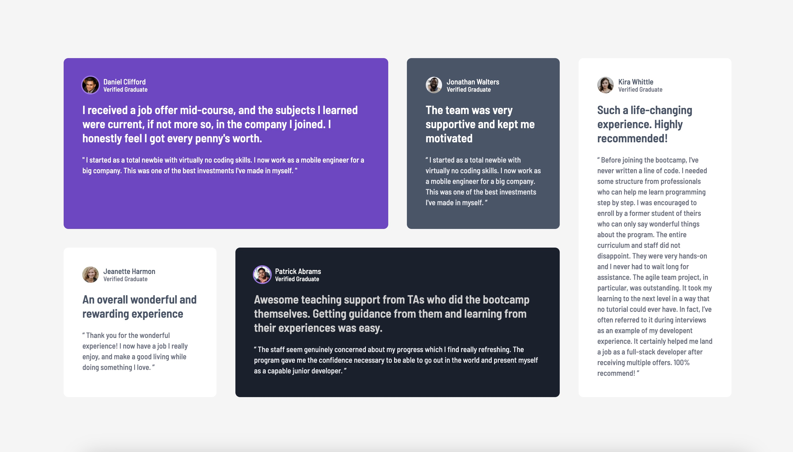
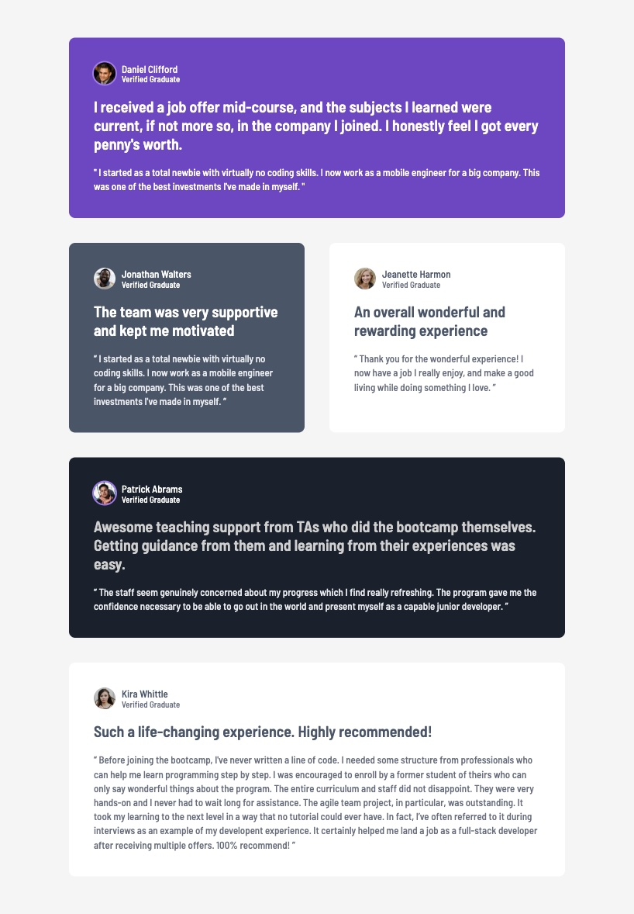

# testimonials-grid-section

## Overview

### Screenshots

| Desktop |
|---------|
|  |

| Mobile | Tablet |
|--------|--------|
|  |   | 

## Key Learnings & Technical Implementation

### **CSS Grid Areas:** 
Utilized `grid-template-areas` to visually map out the layout structure. This approach decouples visual arrangement from HTML order, improving code readability and maintainability.

### **Mobile-First Responsive Design:** 
Implemented a responsive strategy that transitions from a single-column stack on mobile to a 2-column layout on tablets, and finally a 4-column grid on desktops.

### **Fluid Layouts:** 
Adopted a fluid container pattern (using `width: 90%` combined with `max-width`) instead of fixed widths. This prevents horizontal scrolling on small screens while maintaining readability on large monitors.

### **Logical Spacing:** 
Applied `padding-block` and `gap` to ensure consistent vertical rhythm and visual breathing room across all device sizes.